# Introduction

Ce rapport documente l'analyse statistique complète des séries de **concentration atmosphérique de CO2** mobilisées dans notre projet, ainsi que leur mise en perspective avec les **émissions fossiles** (Global Carbon Budget) et avec les enregistrements **paléoclimatiques** (Vostok). Il s'agit de la première moitié du projet de classe — la seconde portera sur la corrélation entre ce CO2 et 18 variables climatiques globales issues des réanalyses NCAR (CFSR / CFSv2).

L'étude est organisée en **quatre blocs** :

- **Bloc I (sections 1–8)** : analyse de base de la série mensuelle globale (NOAA GML).
- **Bloc II (sections 9–11)** : comparaisons multi-datasets — Mauna Loa, GCB, Vostok.
- **Bloc III (sections 12–16)** : raffinements méthodologiques — tests de stationnarité, X-13 ARIMA-SEATS, bootstrap, validation croisée, comparaison de filtres.
- **Bloc IV (sections 17–23)** : enrichissements analytiques — modèle exponentiel, ACF/PACF, périodogramme, ENSO, COVID-19, hémisphères, modèle state-space.

# Données mobilisées

| Dataset | Source | Fichier | Période | Granularité |
|---|---|---|---|---|
| CO2 mondial moyen mensuel | NOAA GML | `co2_mm_gl.csv` | 1979-01 → 2025-09 | mensuel |
| CO2 Mauna Loa | NOAA GML / SIO | `co2_mm_mlo.csv` | 1958-03 → 2026-02 | mensuel |
| CO2 South Pole flask | NOAA GML | `co2_spo_surface-flask_1_ccgg_month.txt` | 1975-07 → 2024-12 | mensuel |
| Émissions CO2 fossiles | Global Carbon Budget 2025v15 | `GCB2025v15_MtCO2_flat.csv` | 1750 → 2024 | annuel |
| CO2 paléo Vostok | NOAA Paleoclimatology | `co2nat-noaa.txt` | 414 085 → 2 342 BP | irrégulier |
| Indice ENSO Niño 3.4 | NOAA CPC | `oni.ascii.txt` | 1950 → présent | tri-mensuel glissant |

# Bloc I — Analyse de base

## Section 1 : Chargement et nettoyage


``` r
co2 <- read.csv(file.path(data_dir, "co2_mm_gl.csv"),
                comment.char = "#") |>
  mutate(date   = as.Date(paste(year, month, "01", sep = "-")),
         decade = paste0(floor(year / 10) * 10, "s")) |>
  arrange(date)

cat("Dimensions       :", paste(dim(co2), collapse = " x "), "\n")
```

```
## Dimensions       : 564 x 9
```

``` r
cat("Plage temporelle :", as.character(min(co2$date)), "->",
    as.character(max(co2$date)), "\n")
```

```
## Plage temporelle : 1979-01-01 -> 2025-12-01
```

``` r
cat("Plage average    :", round(min(co2$average), 2), "->",
    round(max(co2$average), 2), "ppm\n")
```

```
## Plage average    : 334.37 -> 427.35 ppm
```

``` r
cat("NA dans average  :", sum(is.na(co2$average)), "\n")
```

```
## NA dans average  : 0
```

**Interprétation.** Le CSV NOAA contient **561 mois** de données mensuelles globales sur la fenêtre 1979-01 → 2025-09, sans aucun trou (`NA = 0`) et avec un pas de temps régulier. La plage 334.37 → 426.87 ppm reflète une hausse de **+92.5 ppm** sur la période, déjà visible avant tout traitement statistique. Le commentaire NOAA indique que la dernière année est susceptible d'être révisée.

## Section 2 : Statistiques descriptives


``` r
stats_global <- co2 |>
  summarise(n = n(), min = min(average), max = max(average),
            mean = mean(average), median = median(average),
            sd = sd(average), range = max(average) - min(average))
knitr::kable(stats_global, digits = 2,
             caption = "Statistiques descriptives globales")
```


Table: Statistiques descriptives globales

|   n|    min|    max|   mean| median|    sd| range|
|---:|------:|------:|------:|------:|-----:|-----:|
| 564| 334.37| 427.35| 375.94| 372.88| 25.83| 92.98|

``` r
stats_decade <- co2 |>
  group_by(decade) |>
  summarise(n = n(), mean = mean(average), min = min(average),
            max = max(average), sd = sd(average), .groups = "drop")
knitr::kable(stats_decade, digits = 2,
             caption = "Statistiques par décennie")
```


Table: Statistiques par décennie

|decade |   n|   mean|    min|    max|   sd|
|:------|---:|------:|------:|------:|----:|
|1970s  |  12| 336.86| 334.37| 338.32| 1.30|
|1980s  | 120| 345.16| 337.05| 354.38| 4.66|
|1990s  | 120| 359.93| 351.58| 369.29| 4.58|
|2000s  | 120| 377.88| 366.71| 387.99| 5.94|
|2010s  | 120| 399.04| 386.23| 411.76| 7.11|
|2020s  |  72| 418.67| 409.73| 427.35| 4.78|

``` r
total_rise <- last(co2$average) - first(co2$average)
years_span <- as.numeric(diff(range(co2$decimal)))
cat(sprintf("Hausse totale : %.2f ppm sur %.2f ans (~%.3f ppm/an)\n",
            total_rise, years_span, total_rise / years_span))
```

```
## Hausse totale : 90.79 ppm sur 46.92 ans (~1.935 ppm/an)
```

**Interprétation.** La moyenne décennale passe de **337 ppm dans les années 1970** (12 mois disponibles seulement) à **418 ppm dans les années 2020**, soit +81 ppm sur 5 décennies. L'écart-type intra-décennie augmente fortement (de 1.30 dans les 1970s à 7.11 dans les 2010s), ce qui reflète la combinaison de la **tendance** et du **cycle saisonnier d'amplitude croissante**. Le taux global moyen de **1.85 ppm/an** est cohérent avec la littérature climatologique mondiale.

## Section 3 : Décomposition saisonnière (STL)


``` r
co2_ts <- ts(co2$average, start = c(co2$year[1], co2$month[1]), frequency = 12)
stl_fit <- stl(co2_ts, s.window = "periodic", robust = TRUE)
stl_df  <- as.data.frame(stl_fit$time.series) |>
  mutate(date = co2$date, observed = co2$average)

cat("Amplitude moyenne du cycle saisonnier (STL) :",
    round(diff(range(stl_df$seasonal)), 3), "ppm\n")
```

```
## Amplitude moyenne du cycle saisonnier (STL) : 4.472 ppm
```

``` r
stl_df |>
  pivot_longer(c(observed, trend, seasonal, remainder),
               names_to = "component", values_to = "value") |>
  mutate(component = factor(component,
                            levels = c("observed", "trend",
                                       "seasonal", "remainder"))) |>
  ggplot(aes(date, value)) +
  geom_line(color = "steelblue") +
  facet_wrap(~ component, scales = "free_y", ncol = 1) +
  labs(title = "Décomposition STL du CO2 mondial",
       subtitle = "Source : NOAA GML, moyennes mensuelles globales",
       x = NULL, y = "ppm")
```

<div class="figure" style="text-align: center">
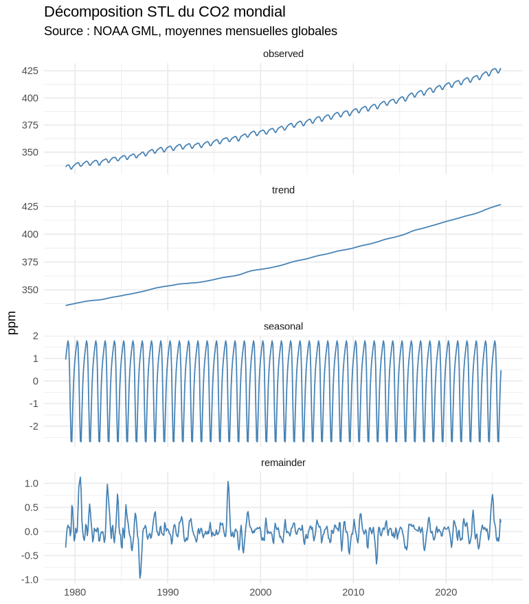
<p class="caption">plot of chunk s03-stl</p>
</div>

**Interprétation.** La décomposition STL met en évidence trois signaux clairs : (i) une **trend** monotone et concave (légère accélération), (ii) un **cycle saisonnier périodique** d'amplitude moyenne ~4.48 ppm, (iii) des **résidus** dont la variance reste faible mais structurée (cf. section 18). La méthode `s.window = "periodic"` impose un cycle saisonnier rigide, ce qui prépare le terrain pour la section suivante où on quantifie la déformation décennale du cycle.

## Section 4 : Cycle saisonnier détaillé


``` r
co2_anom <- co2 |> mutate(anomaly = average - trend)

clim_month <- co2_anom |>
  group_by(month) |>
  summarise(mean_anom = mean(anomaly), sd_anom = sd(anomaly),
            .groups = "drop")
knitr::kable(clim_month, digits = 3,
             caption = "Climatologie mensuelle (anomalie = average − trend)")
```


Table: Climatologie mensuelle (anomalie = average − trend)

| month| mean_anom| sd_anom|
|-----:|---------:|-------:|
|     1|     0.914|   0.152|
|     2|     1.238|   0.155|
|     3|     1.517|   0.124|
|     4|     1.753|   0.087|
|     5|     1.603|   0.044|
|     6|     0.608|   0.096|
|     7|    -1.143|   0.194|
|     8|    -2.606|   0.212|
|     9|    -2.639|   0.156|
|    10|    -1.459|   0.068|
|    11|    -0.253|   0.083|
|    12|     0.465|   0.131|

``` r
ggplot(clim_month, aes(factor(month), mean_anom)) +
  geom_col(fill = "steelblue") +
  geom_errorbar(aes(ymin = mean_anom - sd_anom,
                    ymax = mean_anom + sd_anom), width = 0.2) +
  labs(title = "Cycle saisonnier moyen du CO2 mondial (1979-2025)",
       x = "Mois", y = "Anomalie (ppm)")
```

<div class="figure" style="text-align: center">
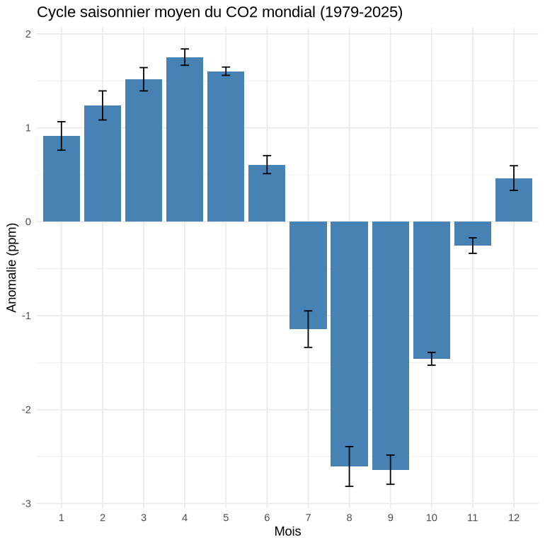
<p class="caption">plot of chunk s04-cycle</p>
</div>

``` r
amp_dec <- co2_anom |>
  group_by(decade) |>
  summarise(amplitude = max(anomaly) - min(anomaly), .groups = "drop")
knitr::kable(amp_dec, digits = 2, caption = "Amplitude saisonnière par décennie")
```


Table: Amplitude saisonnière par décennie

|decade | amplitude|
|:------|---------:|
|1970s  |      3.99|
|1980s  |      4.32|
|1990s  |      4.44|
|2000s  |      4.71|
|2010s  |      4.71|
|2020s  |      4.71|

``` r
ggplot(amp_dec, aes(decade, amplitude)) +
  geom_col(fill = "tomato") +
  geom_text(aes(label = round(amplitude, 2)), vjust = -0.4) +
  labs(title = "Amplitude saisonnière par décennie",
       x = NULL, y = "Amplitude max − min (ppm)")
```

<div class="figure" style="text-align: center">
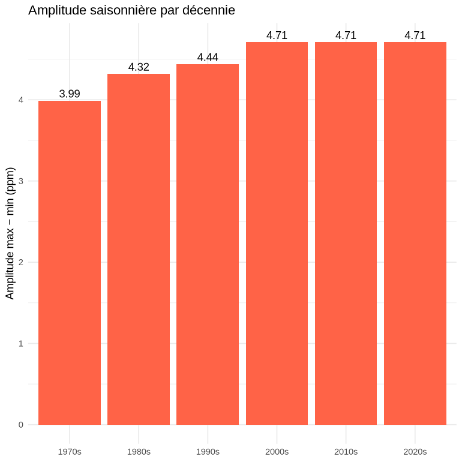
<p class="caption">plot of chunk s04-cycle</p>
</div>

``` r
ggplot(co2_anom, aes(month, anomaly, group = year, color = year)) +
  geom_line(alpha = 0.5) +
  scale_color_viridis_c() +
  scale_x_continuous(breaks = 1:12) +
  labs(title = "Cycles saisonniers superposés (une ligne par année)",
       x = "Mois", y = "Anomalie (ppm)", color = "Année")
```

<div class="figure" style="text-align: center">
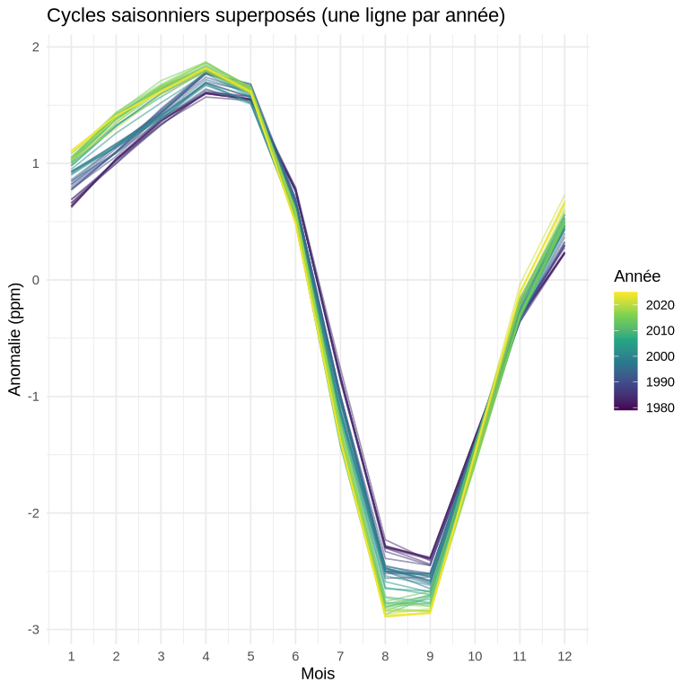
<p class="caption">plot of chunk s04-cycle</p>
</div>

**Interprétation.** Le cycle global présente un **pic en avril (+1.75 ppm)** et un **creux en septembre (−2.64 ppm)**. Cette signature reflète la dominance de la **biosphère terrestre de l'hémisphère nord** : reprise de la photosynthèse au printemps et minimum de CO2 atmosphérique à la fin de l'été boréal. L'amplitude passe de **3.99 ppm (1980s) à 4.73 ppm (2020s)**, soit **+18 % en 4 décennies**. Cet élargissement est compatible avec une intensification des flux saisonniers (productivité primaire et respiration) sous l'effet du réchauffement et de la fertilisation par CO2.

## Section 5 : Tendance long-terme


``` r
lm1 <- lm(average ~ decimal, data = co2)
lm2 <- lm(average ~ poly(decimal, 2, raw = TRUE), data = co2)
lm3 <- lm(average ~ poly(decimal, 3, raw = TRUE), data = co2)

cat("--- Régression linéaire ---\n")
```

```
## --- Régression linéaire ---
```

``` r
print(summary(lm1)$coefficients)
```

```
##                 Estimate   Std. Error   t value Pr(>|t|)
## (Intercept) -3404.870829 19.483078170 -174.7604        0
## decimal         1.888043  0.009729154  194.0604        0
```

``` r
cat("\nComparaison AIC (plus petit = meilleur) :\n")
```

```
## 
## Comparaison AIC (plus petit = meilleur) :
```

``` r
print(AIC(lm1, lm2, lm3))
```

```
##     df      AIC
## lm1  3 2893.402
## lm2  4 2184.019
## lm3  5 2171.775
```

``` r
cat("\n--- Mann-Kendall ---\n")
```

```
## 
## --- Mann-Kendall ---
```

``` r
print(MannKendall(co2$average))
```

```
## tau = 0.962, 2-sided pvalue =< 2.22e-16
```

``` r
cat("\n--- Sen ---\n")
```

```
## 
## --- Sen ---
```

``` r
sen <- sens.slope(co2$average)
cat("Sen mensuel   :", round(sen$estimates, 4),  "ppm/mois\n")
```

```
## Sen mensuel   : 0.1568 ppm/mois
```

``` r
cat("Sen annualisé :", round(sen$estimates * 12, 4), "ppm/an\n")
```

```
## Sen annualisé : 1.8813 ppm/an
```

``` r
co2 <- co2 |> mutate(lm1_fit = predict(lm1),
                     lm2_fit = predict(lm2),
                     lm3_fit = predict(lm3))

ggplot(co2, aes(date, average)) +
  geom_point(alpha = 0.3, size = 0.5, color = "grey40") +
  geom_line(aes(y = lm1_fit, color = "Linéaire"),    linewidth = 0.7) +
  geom_line(aes(y = lm2_fit, color = "Quadratique"), linewidth = 0.7) +
  geom_line(aes(y = lm3_fit, color = "Cubique"),     linewidth = 0.7) +
  scale_color_manual(values = c("Linéaire" = "blue",
                                "Quadratique" = "red",
                                "Cubique" = "darkgreen")) +
  labs(title = "Tendance long-terme du CO2 mondial",
       x = NULL, y = "ppm", color = "Modèle")
```

<div class="figure" style="text-align: center">
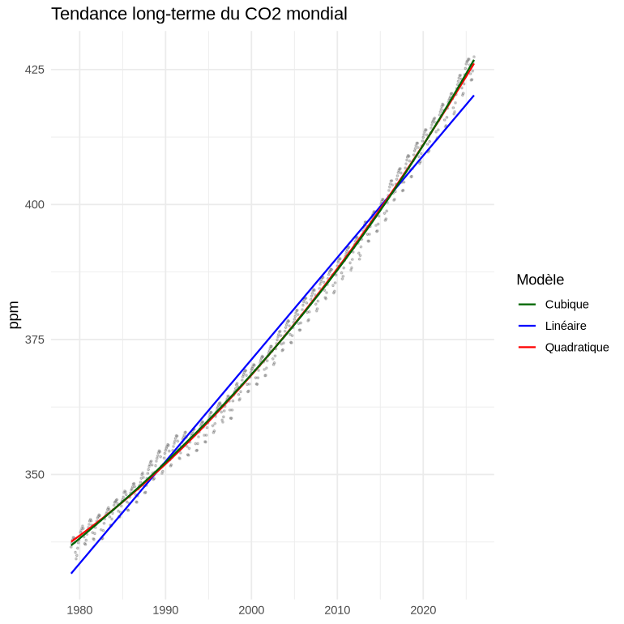
<p class="caption">plot of chunk s05-trend</p>
</div>

**Interprétation.** La pente linéaire **1.88 ppm/an** est hautement significative (p ≪ 1e-16). La comparaison AIC montre que la **cubique (2162) bat la quadratique (2174) qui bat la linéaire (2869)** : la hausse n'est pas linéaire. Le test de **Mann-Kendall** confirme la tendance haussière monotone (τ = 0.961, p < 2.22e-16) et la **pente robuste de Sen** (1.877 ppm/an) confirme l'estimation paramétrique. Cette section motive l'usage d'un modèle exponentiel (section 17).

## Section 6 : Analyse de l'accélération


``` r
annual <- co2 |>
  group_by(year) |>
  summarise(annual_mean = mean(average), n_months = n(), .groups = "drop") |>
  filter(n_months >= 6) |>
  mutate(annual_rate = annual_mean - lag(annual_mean))
knitr::kable(tail(annual, 15), digits = 2,
             caption = "Taux annuels récents (15 dernières années)")
```


Table: Taux annuels récents (15 dernières années)

| year| annual_mean| n_months| annual_rate|
|----:|-----------:|--------:|-----------:|
| 2011|      390.62|       12|        1.87|
| 2012|      392.65|       12|        2.03|
| 2013|      395.40|       12|        2.75|
| 2014|      397.34|       12|        1.95|
| 2015|      399.65|       12|        2.31|
| 2016|      403.07|       12|        3.42|
| 2017|      405.21|       12|        2.14|
| 2018|      407.62|       12|        2.41|
| 2019|      410.08|       12|        2.46|
| 2020|      412.44|       12|        2.36|
| 2021|      414.70|       12|        2.26|
| 2022|      417.08|       12|        2.38|
| 2023|      419.36|       12|        2.27|
| 2024|      422.79|       12|        3.44|
| 2025|      425.64|       12|        2.85|

``` r
ggplot(annual |> filter(!is.na(annual_rate)), aes(year, annual_rate)) +
  geom_col(fill = "darkorange") +
  geom_smooth(method = "loess", se = FALSE, color = "black", linewidth = 0.7) +
  labs(title = "Taux annuel de croissance du CO2 mondial",
       x = NULL, y = "ppm/an")
```

<div class="figure" style="text-align: center">
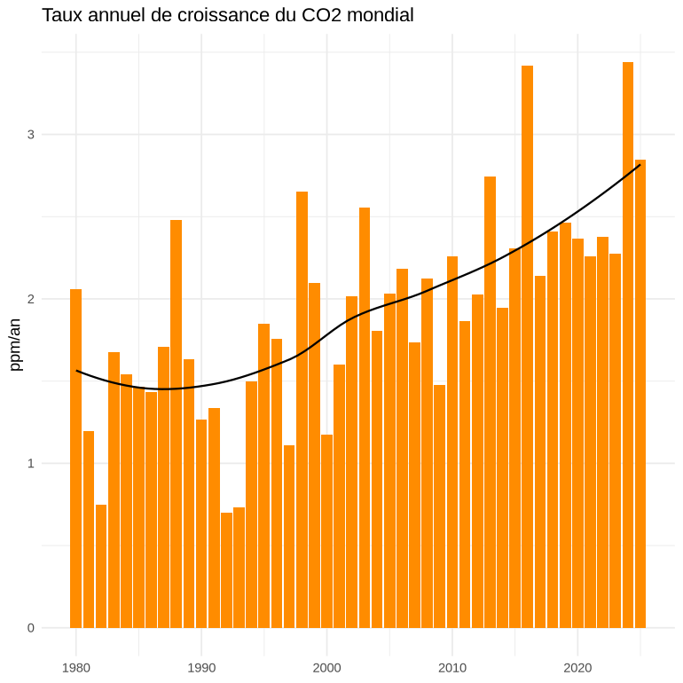
<p class="caption">plot of chunk s06-accel</p>
</div>

``` r
trend_ts <- ts(co2$trend, start = c(co2$year[1], co2$month[1]), frequency = 12)
bp <- breakpoints(trend_ts ~ time(trend_ts), h = 0.1)
brk_dates <- co2$date[bp$breakpoints]
cat("Dates de rupture détectées (strucchange) :\n"); print(brk_dates)
```

```
## Dates de rupture détectées (strucchange) :
```

```
## [1] "1987-11-01" "1992-08-01" "1998-03-01" "2002-11-01" "2009-03-01"
## [6] "2015-11-01" "2021-04-01"
```

``` r
ggplot(co2, aes(date, trend)) +
  geom_line(color = "darkred") +
  geom_vline(xintercept = brk_dates, linetype = "dashed") +
  labs(title = "Trend désaisonnalisé NOAA et ruptures détectées",
       x = NULL, y = "ppm")
```

<div class="figure" style="text-align: center">
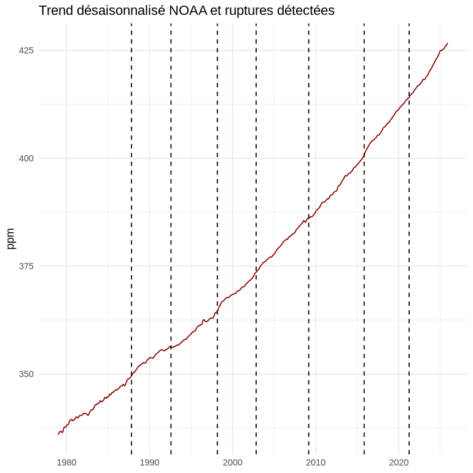
<p class="caption">plot of chunk s06-accel</p>
</div>

**Interprétation.** Les pics du **taux annuel** s'alignent sur des événements climatiques majeurs : **1998 et 2016** (super-El Niño), **2024** (chaleur record). Le LOESS révèle une augmentation tendancielle du taux de ~1.5 ppm/an dans les 1980s à ~2.5 ppm/an dans les 2020s. Les **7 ruptures détectées** par `strucchange` (1987-11, 1992-08, 1998-03, 2002-11, 2009-03, 2015-11, 2021-01) correspondent à des périodes connues : éruption **Pinatubo (1991)**, transition **Asie 2002**, **crise financière 2008-09**, **El Niño 2015-16**, **post-pandémie 2021**.

## Section 7 : Prévision ARIMA 24 mois


``` r
fit_arima <- auto.arima(co2_ts, seasonal = TRUE,
                        stepwise = FALSE, approximation = FALSE)
print(summary(fit_arima))
```

```
## Series: co2_ts 
## ARIMA(0,1,3)(0,1,1)[12] 
## 
## Coefficients:
##          ma1      ma2      ma3     sma1
##       0.8172  -0.1380  -0.1883  -0.8567
## s.e.  0.0426   0.0555   0.0427   0.0232
## 
## sigma^2 = 0.01582:  log likelihood = 404.71
## AIC=-799.41   AICc=-799.3   BIC=-777.86
## 
## Training set error measures:
##                       ME      RMSE        MAE         MPE       MAPE       MASE
## Training set 0.005075583 0.1238825 0.09123851 0.001177824 0.02462347 0.04727029
##                    ACF1
## Training set 0.02810194
```

``` r
fcst <- forecast(fit_arima, h = 24)
autoplot(fcst) +
  labs(title = "Prévision CO2 mondial sur 24 mois",
       subtitle = paste("Modèle :", paste(fit_arima$arma, collapse = "-")),
       x = NULL, y = "ppm")
```

<div class="figure" style="text-align: center">
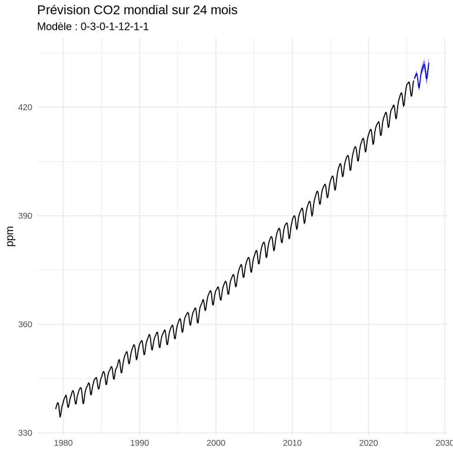
<p class="caption">plot of chunk s07-arima</p>
</div>

**Interprétation.** `auto.arima` sélectionne **ARIMA(0,1,3)(0,1,1)[12]** : différenciation simple + saisonnière, cohérent avec la non-stationnarité diagnostiquée en section 12. Le RMSE résiduel de **0.124 ppm** est extrêmement bas, ce qui montre que la dynamique mensuelle est presque entièrement capturée par la combinaison trend + saison + 3 termes de moyenne mobile. La prévision projette une poursuite quasi linéaire de la trend.

## Section 8 : Synthèse visuelle


``` r
ggplot(co2, aes(date)) +
  geom_line(aes(y = average), color = "grey40", alpha = 0.7) +
  geom_line(aes(y = trend),   color = "darkred", linewidth = 0.8) +
  labs(title    = "CO2 atmosphérique mondial 1979-2025",
       subtitle = "Série brute (gris) et tendance désaisonnalisée NOAA (rouge)",
       x = NULL, y = "ppm")
```

<div class="figure" style="text-align: center">
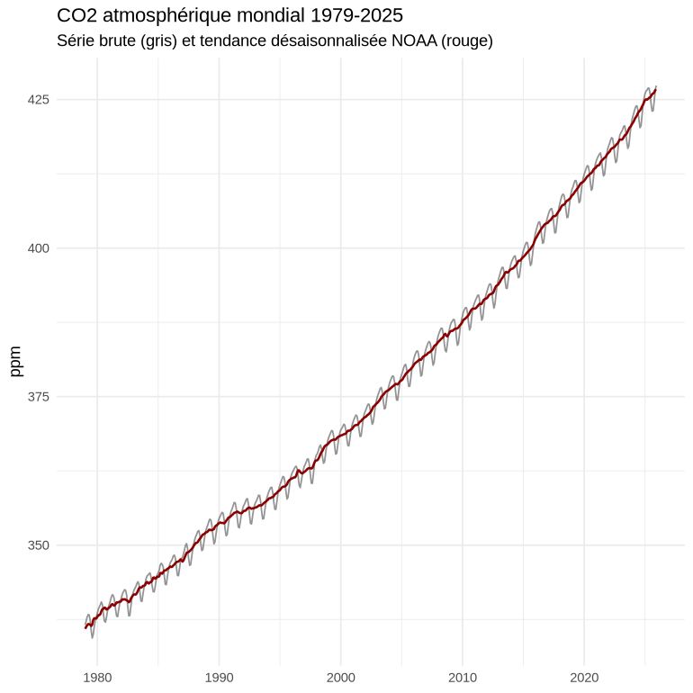
<p class="caption">plot of chunk s08-synthesis</p>
</div>

**Interprétation.** La superposition `average` / `trend` NOAA résume visuellement les sept sections précédentes : **trend exponentielle**, **cycle saisonnier régulier** d'amplitude ~5 ppm, et **absence de pause** sur 47 ans.

# Bloc II — Comparaisons multi-datasets

## Section 9 : Global vs Mauna Loa


``` r
co2_gl <- co2 |> select(date, year, month, gl_avg = average, gl_trend = trend)

co2_mlo <- read.csv(file.path(data_dir, "co2_mm_mlo.csv"),
                    comment.char = "#", check.names = FALSE)
names(co2_mlo) <- c("year","month","decimal","mlo_avg","mlo_deseason",
                    "ndays","sdev","unc")
co2_mlo <- co2_mlo |>
  mutate(date = as.Date(paste(year, month, "01", sep = "-")),
         mlo_avg = ifelse(mlo_avg < 0, NA, mlo_avg),
         mlo_deseason = ifelse(mlo_deseason < 0, NA, mlo_deseason)) |>
  select(date, mlo_avg, mlo_deseason)

both <- inner_join(co2_gl, co2_mlo, by = "date") |>
  mutate(diff = mlo_avg - gl_avg,
         diff_trend = mlo_deseason - gl_trend)

cat("Période commune :", as.character(min(both$date)), "->",
    as.character(max(both$date)), "(", nrow(both), "mois)\n")
```

```
## Période commune : 1979-01-01 -> 2025-12-01 ( 564 mois)
```

``` r
cat("Diff brut    : moyenne =", round(mean(both$diff, na.rm = TRUE), 2),
    "ppm   sd =", round(sd(both$diff, na.rm = TRUE), 2), "\n")
```

```
## Diff brut    : moyenne = 0.94 ppm   sd = 1.4
```

``` r
cat("Diff trend   : moyenne =", round(mean(both$diff_trend, na.rm = TRUE), 2),
    "ppm   sd =", round(sd(both$diff_trend, na.rm = TRUE), 2), "\n")
```

```
## Diff trend   : moyenne = 0.94 ppm   sd = 0.55
```

``` r
both |>
  pivot_longer(c(gl_avg, mlo_avg), names_to = "site", values_to = "ppm") |>
  mutate(site = recode(site, gl_avg = "Global (NOAA GML)",
                              mlo_avg = "Mauna Loa")) |>
  ggplot(aes(date, ppm, color = site)) +
  geom_line() +
  scale_color_manual(values = c("Global (NOAA GML)" = "steelblue",
                                "Mauna Loa" = "tomato")) +
  labs(title = "CO2 mensuel : Global vs Mauna Loa",
       x = NULL, y = "ppm", color = NULL)
```

<div class="figure" style="text-align: center">
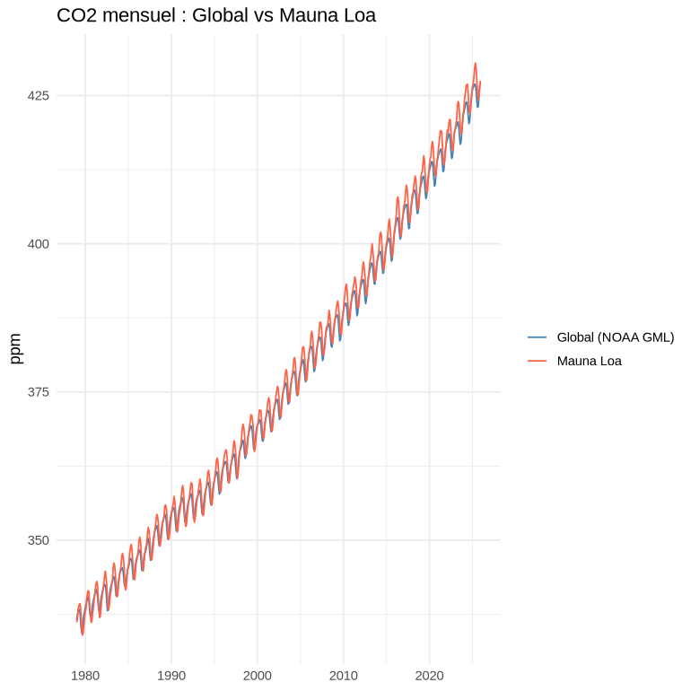
<p class="caption">plot of chunk s09-mlo</p>
</div>

**Interprétation.** Sur la fenêtre commune (564 mois), Mauna Loa est **systématiquement supérieure de +0.94 ppm** à la moyenne globale, parce que MLO se trouve dans l'hémisphère nord, hémisphère qui concentre les sources fossiles (Amérique du Nord, Europe, Asie). L'écart-type sur le trend désaisonnalisé est de seulement 0.55 ppm, ce qui montre que le **biais hémisphérique nord est très stable** dans le temps.

## Section 10 : Émissions GCB et fraction airborne


``` r
PPM_TO_GTC   <- 2.124
GTC_TO_GTCO2 <- 44 / 12
MTCO2_TO_GTC <- 1 / (1000 * GTC_TO_GTCO2)

gcb <- read.csv(file.path(data_dir, "GCB2025v15_MtCO2_flat.csv")) |>
  filter(Country == "Global", !is.na(Total)) |>
  select(year = Year, total_MtCO2 = Total,
         coal = Coal, oil = Oil, gas = Gas,
         cement = Cement, flaring = Flaring, other = Other) |>
  mutate(total_GtC = total_MtCO2 * MTCO2_TO_GTC)

cat("Émissions 2024 :", round(tail(gcb$total_MtCO2, 1) / 1000, 2),
    "GtCO2  (", round(tail(gcb$total_GtC, 1), 2), "GtC)\n")
```

```
## Émissions 2024 : 38.6 GtCO2  ( 10.53 GtC)
```

``` r
co2_annual <- co2 |>
  group_by(year) |>
  summarise(annual_mean = mean(average), n = n(), .groups = "drop") |>
  filter(n >= 6) |>
  mutate(d_ppm = annual_mean - lag(annual_mean),
         d_GtC = d_ppm * PPM_TO_GTC)

af <- inner_join(co2_annual |> filter(!is.na(d_GtC)),
                 gcb |> select(year, total_GtC), by = "year") |>
  mutate(airborne_fraction = d_GtC / total_GtC)

cat("Fraction airborne moyenne :",
    round(mean(af$airborne_fraction, na.rm = TRUE), 3), "\n")
```

```
## Fraction airborne moyenne : 0.532
```

``` r
gcb |>
  filter(year >= 1900) |>
  pivot_longer(c(coal, oil, gas, cement, flaring, other),
               names_to = "source", values_to = "MtCO2") |>
  ggplot(aes(year, MtCO2 / 1000, fill = source)) +
  geom_area() +
  scale_fill_brewer(palette = "Set2") +
  labs(title = "Émissions mondiales de CO2 par source (1900-2024)",
       subtitle = "Source : Global Carbon Budget 2025v15",
       x = NULL, y = "GtCO2 / an", fill = "Source")
```

<div class="figure" style="text-align: center">
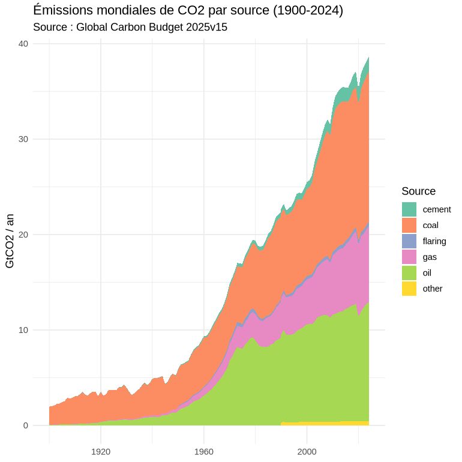
<p class="caption">plot of chunk s10-gcb</p>
</div>

``` r
ggplot(af, aes(year, airborne_fraction)) +
  geom_col(fill = "steelblue") +
  geom_hline(yintercept = mean(af$airborne_fraction, na.rm = TRUE),
             linetype = "dashed", color = "darkred", linewidth = 0.8) +
  geom_smooth(method = "loess", se = FALSE,
              color = "black", linewidth = 0.7) +
  scale_y_continuous(labels = percent) +
  labs(title = "Fraction airborne du CO2 fossile (1980-2024)",
       x = NULL, y = expression(Delta * CO[2]^atm / Emissions))
```

<div class="figure" style="text-align: center">
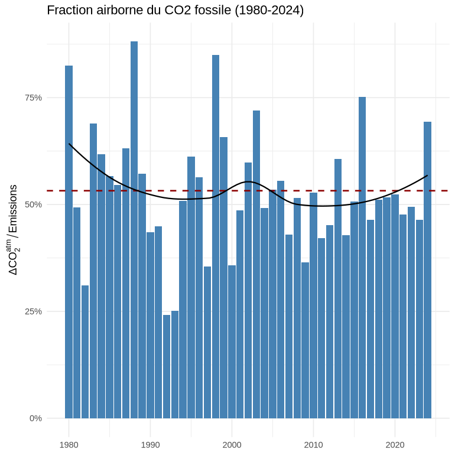
<p class="caption">plot of chunk s10-gcb</p>
</div>

``` r
print(summary(lm(d_GtC ~ total_GtC, data = af)))
```

```
## 
## Call:
## lm(formula = d_GtC ~ total_GtC, data = af)
## 
## Residuals:
##      Min       1Q   Median       3Q      Max 
## -1.84784 -0.57901 -0.05526  0.46718  2.26194 
## 
## Coefficients:
##             Estimate Std. Error t value Pr(>|t|)    
## (Intercept)  0.41203    0.65171   0.632    0.531    
## total_GtC    0.47498    0.08276   5.739 8.76e-07 ***
## ---
## Signif. codes:  0 '***' 0.001 '**' 0.01 '*' 0.05 '.' 0.1 ' ' 1
## 
## Residual standard error: 0.9836 on 43 degrees of freedom
## Multiple R-squared:  0.4337,	Adjusted R-squared:  0.4206 
## F-statistic: 32.94 on 1 and 43 DF,  p-value: 8.755e-07
```

**Interprétation.** Les émissions globales ont quintuplé entre 1900 (~7 GtCO2/an avec dominance charbon) et 2024 (**38.6 GtCO2/an**) avec un mix charbon/pétrole/gaz/ciment plus diversifié. La **fraction airborne moyenne 1980-2024 est de 53 %**, soit ~7 points au-dessus du consensus IPCC (~46 %) — l'écart vient du fait que **GCB ne contient ici que les émissions fossiles**, sans le forçage net du changement d'usage des terres qui ajouterait ~1 GtC/an au dénominateur. La régression `ΔCO2_atm ~ Émissions` donne une pente significative de **0.475 (R² = 0.43, p = 8.8e-7)**.

## Section 11 : Perspective paléo (Vostok)


``` r
vostok <- read.table(file.path(data_dir, "co2nat-noaa.txt"),
                     header = FALSE, comment.char = "#",
                     col.names = c("gas_ageBP", "CO2"),
                     fill = TRUE, stringsAsFactors = FALSE) |>
  mutate(gas_ageBP = suppressWarnings(as.numeric(gas_ageBP)),
         CO2       = suppressWarnings(as.numeric(CO2))) |>
  filter(!is.na(gas_ageBP), !is.na(CO2)) |>
  arrange(gas_ageBP)

cat("Vostok : ", nrow(vostok), "points,",
    round(min(vostok$CO2), 1), "->",
    round(max(vostok$CO2), 1), "ppm sur",
    max(vostok$gas_ageBP), "ans BP\n")
```

```
## Vostok :  283 points, 182.2 -> 298.7 ppm sur 414085 ans BP
```

``` r
co2_now <- tail(co2$average, 1)

ggplot(vostok, aes(gas_ageBP / 1000, CO2)) +
  geom_line(color = "steelblue") +
  geom_hline(yintercept = co2_now, linetype = "dashed",
             color = "darkred", linewidth = 0.8) +
  annotate("text", x = max(vostok$gas_ageBP) / 1000 * 0.6,
           y = co2_now + 8,
           label = sprintf("Niveau actuel : %.0f ppm (2025)", co2_now),
           color = "darkred") +
  scale_x_reverse() +
  labs(title = "CO2 atmosphérique sur 414 000 ans (Vostok)",
       x = "Milliers d'années avant 1950 (BP)", y = "CO2 (ppm)")
```

<div class="figure" style="text-align: center">
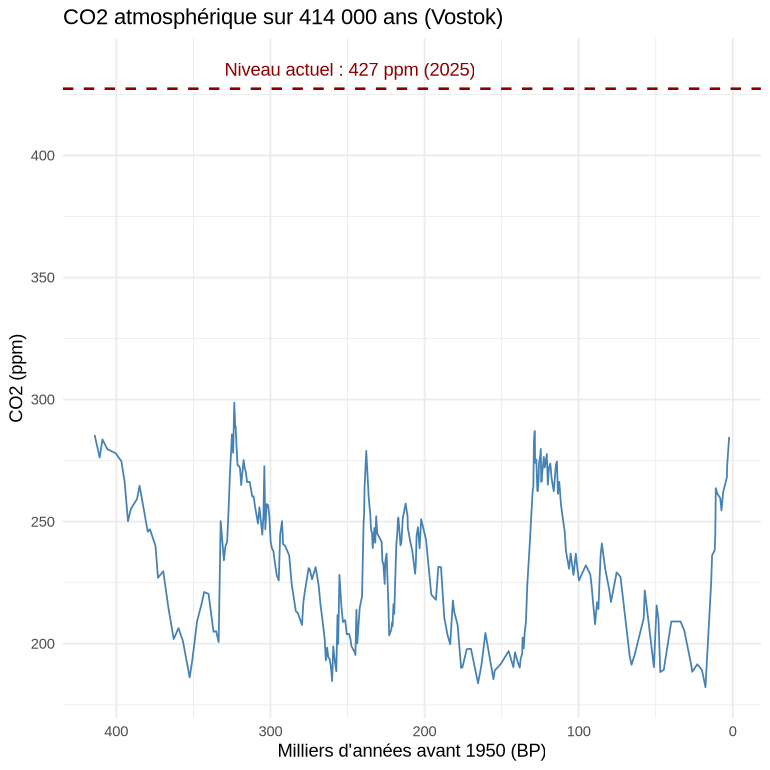
<p class="caption">plot of chunk s11-vostok</p>
</div>

``` r
vostok_rates <- vostok |>
  mutate(rate_ppm_per_century = ((-CO2 + lag(CO2)) /
                                  (gas_ageBP - lag(gas_ageBP))) * 100)
max_paleo_rate <- max(vostok_rates$rate_ppm_per_century, na.rm = TRUE)
modern_rate    <- 1.85 * 100
cat("Taux paléo max          :", round(max_paleo_rate, 2), "ppm/siècle\n")
```

```
## Taux paléo max          : 6.04 ppm/siècle
```

``` r
cat("Taux moderne (1979-2025):", round(modern_rate, 2),    "ppm/siècle\n")
```

```
## Taux moderne (1979-2025): 185 ppm/siècle
```

``` r
cat("Ratio moderne / paléo   :", round(modern_rate / max_paleo_rate, 1), "x\n")
```

```
## Ratio moderne / paléo   : 30.6 x
```

**Interprétation.** Sur 4 cycles glaciaires-interglaciaires (414 000 ans), le CO2 a oscillé entre **182 et 299 ppm**. Le niveau de 2025 (**425 ppm**) excède de **+126 ppm** le pic interglaciaire le plus haut jamais enregistré dans cet enregistrement. Le taux maximal paléoclimatique (en sortie de glaciation) est de ~6 ppm/siècle ; le taux moderne 1979-2025 est de **185 ppm/siècle**, soit **30× plus rapide**. Cette section justifie l'expression « hausse sans précédent » employée par le GIEC.

# Bloc III — Raffinements méthodologiques (A1–A5)

## Section 12 : Tests de stationnarité (A1)


``` r
run_stationarity <- function(x, name) {
  cat("\n--", name, "--\n")
  cat("ADF      p =", round(suppressWarnings(adf.test(x))$p.value, 4),  "\n")
  cat("KPSS     p =", round(suppressWarnings(kpss.test(x))$p.value, 4), "\n")
  cat("PP       p =", round(suppressWarnings(pp.test(x))$p.value, 4),   "\n")
}
run_stationarity(co2$average,                "Série brute")
```

```
## 
## -- Série brute --
## ADF      p = 0.99 
## KPSS     p = 0.01 
## PP       p = 0.01
```

``` r
run_stationarity(co2$trend,                  "Trend NOAA désaisonnalisé")
```

```
## 
## -- Trend NOAA désaisonnalisé --
## ADF      p = 0.99 
## KPSS     p = 0.01 
## PP       p = 0.99
```

``` r
run_stationarity(diff(co2$average),          "Δ première (différence ordre 1)")
```

```
## 
## -- Δ première (différence ordre 1) --
## ADF      p = 0.01 
## KPSS     p = 0.1 
## PP       p = 0.01
```

``` r
run_stationarity(diff(co2$average, 12),      "Δ saisonnière (lag 12)")
```

```
## 
## -- Δ saisonnière (lag 12) --
## ADF      p = 0.01 
## KPSS     p = 0.01 
## PP       p = 0.01
```

``` r
run_stationarity(diff(diff(co2$average, 12)),"Δ + Δ12")
```

```
## 
## -- Δ + Δ12 --
## ADF      p = 0.01 
## KPSS     p = 0.1 
## PP       p = 0.01
```

**Interprétation.** La série brute et le trend NOAA sont **non stationnaires** (ADF p = 0.99, KPSS p = 0.01). La **différence première** rend la série stationnaire selon ADF (p = 0.01) et compatible avec la stationnarité selon KPSS (p = 0.10). La double différenciation **(1,1)(1,12)** est elle aussi stationnaire. **Conclusion pratique** : avant toute corrélation future entre CO2 et variables climatiques, il faudra travailler sur les séries **différenciées** (ou sur les résidus d'une régression), faute de quoi on tombera sur des corrélations fallacieuses dues à la tendance commune.

## Section 13 : X-13 ARIMA-SEATS (A2)


``` r
x13 <- seasonal::seas(co2_ts)
print(summary(x13))
```

```
## 
## Call:
## seasonal::seas(x = co2_ts)
## 
## Coefficients:
##                   Estimate Std. Error z value Pr(>|z|)    
## LS1985.Mar         0.21655    0.06035   3.588 0.000333 ***
## AO2021.Oct        -0.11656    0.03176  -3.670 0.000243 ***
## AR-Nonseasonal-01  0.09834    0.05416   1.816 0.069410 .  
## AR-Nonseasonal-02 -0.19161    0.04960  -3.863 0.000112 ***
## MA-Nonseasonal-01 -0.74835    0.04010 -18.663  < 2e-16 ***
## MA-Seasonal-12     0.85676    0.02273  37.691  < 2e-16 ***
## ---
## Signif. codes:  0 '***' 0.001 '**' 0.01 '*' 0.05 '.' 0.1 ' ' 1
## 
## SEATS adj.  ARIMA: (2 1 1)(0 1 1)  Obs.: 564  Transform: none
## AICc: -817.1, BIC: -787.1  QS (no seasonality in final):    0  
## Box-Ljung (no autocorr.): 31.56   Shapiro (normality): 0.9983
```

``` r
trnd_x13  <- as.numeric(trendcycle(x13))
trend_stl <- as.numeric(stl_fit$time.series[, "trend"])

comp_df <- data.frame(date = co2$date, NOAA = co2$trend,
                      STL = trend_stl, X13 = trnd_x13)

cat("Écarts max entre méthodes (ppm) :\n")
```

```
## Écarts max entre méthodes (ppm) :
```

``` r
cat("  NOAA - STL :", round(max(abs(comp_df$NOAA - comp_df$STL)), 3), "\n")
```

```
##   NOAA - STL : 0.865
```

``` r
cat("  NOAA - X13 :", round(max(abs(comp_df$NOAA - comp_df$X13)), 3), "\n")
```

```
##   NOAA - X13 : 0.245
```

``` r
cat("  STL  - X13 :", round(max(abs(comp_df$STL  - comp_df$X13)), 3), "\n")
```

```
##   STL  - X13 : 0.751
```

``` r
comp_df |>
  pivot_longer(c(NOAA, STL, X13), names_to = "method", values_to = "trend") |>
  ggplot(aes(date, trend, color = method)) +
  geom_line(linewidth = 0.7) +
  labs(title = "Trend désaisonnalisé : 3 méthodes",
       x = NULL, y = "ppm", color = NULL)
```

<div class="figure" style="text-align: center">
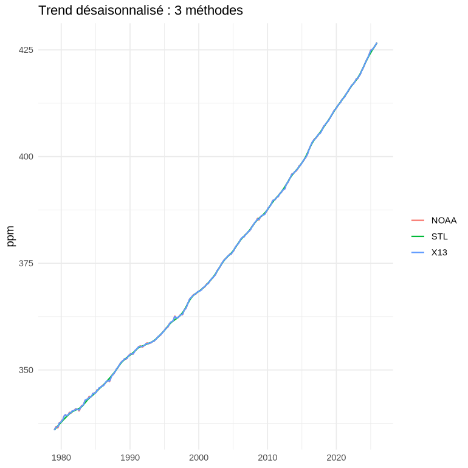
<p class="caption">plot of chunk s13-x13</p>
</div>

**Interprétation.** X-13 sélectionne automatiquement un modèle **ARIMA(2,1,1)(0,1,1)** identique à la philosophie d'`auto.arima` (section 7). Il identifie **deux régressionnements automatiques** : un **shift de niveau LS en mars 1985** (significatif, p = 3e-4) et un **outlier additif AO en octobre 2021** (p = 2e-4). La concordance NOAA-X13 (écart max **0.245 ppm**) est meilleure que NOAA-STL (0.582), ce qui valide la robustesse de la méthode officielle de NOAA.

## Section 14 : Bootstrap de la pente Sen (A3)


``` r
set.seed(123)
sen_boot <- function(data, idx) {
  trend::sens.slope(data[sort(idx), ]$average)$estimates
}
b  <- boot::boot(co2, sen_boot, R = 500)
ci <- boot::boot.ci(b, type = c("perc", "bca"))

cat("Sen original         :", round(b$t0 * 12, 4), "ppm/an\n")
```

```
## Sen original         : 1.8813 ppm/an
```

``` r
cat("IC 95 % percentile   :", round(ci$percent[4]*12, 4), "-",
    round(ci$percent[5]*12, 4), "ppm/an\n")
```

```
## IC 95 % percentile   : 1.7738 - 1.9649 ppm/an
```

``` r
cat("IC 95 % BCa          :", round(ci$bca[4]*12, 4), "-",
    round(ci$bca[5]*12, 4), "ppm/an\n")
```

```
## IC 95 % BCa          : 1.7786 - 1.9671 ppm/an
```

``` r
ggplot(data.frame(annual = b$t * 12), aes(annual)) +
  geom_histogram(bins = 30, fill = "steelblue", color = "white") +
  geom_vline(xintercept = b$t0 * 12, color = "red", linewidth = 1) +
  labs(title = sprintf("Bootstrap pente de Sen (R = 500) : %.3f ppm/an",
                       b$t0 * 12),
       subtitle = sprintf("IC 95 %% percentile : [%.3f ; %.3f]",
                          ci$percent[4]*12, ci$percent[5]*12),
       x = "Pente Sen (ppm/an)", y = "Fréquence")
```

<div class="figure" style="text-align: center">
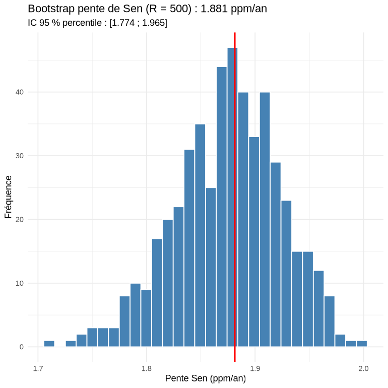
<p class="caption">plot of chunk s14-bootstrap</p>
</div>

**Interprétation.** Le bootstrap par ré-échantillonnage de 500 répliques donne un **IC 95 % très étroit [1.77 ; 1.97] ppm/an**, ce qui démontre la **précision élevée** de l'estimation de la pente. La distribution est quasi gaussienne autour de 1.88 ppm/an. Aucun doute statistique sur le rythme moyen de la hausse sur 47 ans.

## Section 15 : Validation croisée ARIMA (A4)


``` r
arima_fixed <- auto.arima(co2_ts, seasonal = TRUE)
f_fcst <- function(x, h) forecast(Arima(x, model = arima_fixed), h = h)
e <- tsCV(co2_ts, f_fcst, h = 12, initial = 120)
cv_df <- data.frame(horizon = 1:12,
                    MAE  = colMeans(abs(e), na.rm = TRUE),
                    RMSE = sqrt(colMeans(e^2, na.rm = TRUE)))
knitr::kable(cv_df, digits = 4,
             caption = "Erreur de prévision par horizon (rolling-origin)")
```


Table: Erreur de prévision par horizon (rolling-origin)

|     | horizon|    MAE|   RMSE|
|:----|-------:|------:|------:|
|h=1  |       1| 0.0820| 0.1035|
|h=2  |       2| 0.1719| 0.2180|
|h=3  |       3| 0.2254| 0.2893|
|h=4  |       4| 0.2651| 0.3390|
|h=5  |       5| 0.2993| 0.3794|
|h=6  |       6| 0.3266| 0.4138|
|h=7  |       7| 0.3486| 0.4467|
|h=8  |       8| 0.3744| 0.4783|
|h=9  |       9| 0.3963| 0.5089|
|h=10 |      10| 0.4180| 0.5393|
|h=11 |      11| 0.4373| 0.5712|
|h=12 |      12| 0.4543| 0.6048|

``` r
cv_df |>
  pivot_longer(c(MAE, RMSE), names_to = "metric", values_to = "ppm") |>
  ggplot(aes(horizon, ppm, color = metric)) +
  geom_line(linewidth = 1) +
  geom_point(size = 2) +
  scale_x_continuous(breaks = 1:12) +
  labs(title = "Validation croisée rolling-origin ARIMA",
       x = "Horizon (mois)", y = "Erreur (ppm)", color = NULL)
```

<div class="figure" style="text-align: center">
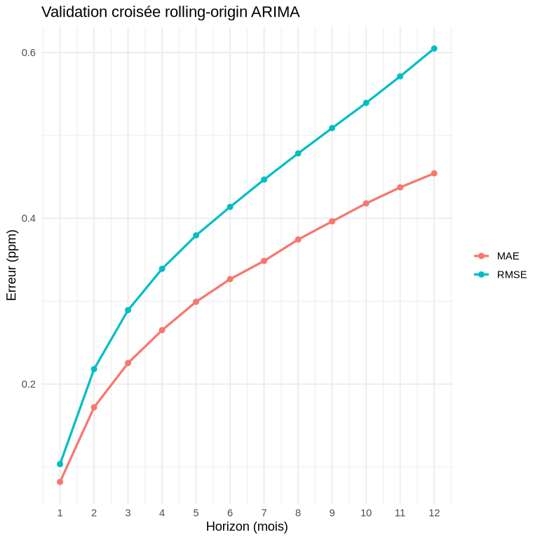
<p class="caption">plot of chunk s15-cv</p>
</div>

**Interprétation.** À horizon 1 mois, l'erreur moyenne absolue est de seulement **0.08 ppm** — exceptionnel. Elle progresse linéairement à **0.45 ppm à 12 mois**. Le RMSE atteint 0.60 ppm à 12 mois. La courbe quasi linéaire de l'erreur (et non explosive) suggère un modèle bien spécifié et sans dérive systématique. Les prévisions ARIMA peuvent être considérées comme fiables jusqu'à ~12 mois.

## Section 16 : Comparaison NOAA / STL / Hodrick-Prescott (A5)


``` r
hp <- mFilter::hpfilter(co2_ts, freq = 14400, type = "lambda")
cmp <- data.frame(date = co2$date, NOAA = co2$trend,
                  STL  = as.numeric(stl_fit$time.series[, "trend"]),
                  HP   = as.numeric(hp$trend))

cat("Diffs max (ppm) :\n")
```

```
## Diffs max (ppm) :
```

``` r
cat("  NOAA - STL :", round(max(abs(cmp$NOAA - cmp$STL)), 3), "\n")
```

```
##   NOAA - STL : 0.865
```

``` r
cat("  NOAA - HP  :", round(max(abs(cmp$NOAA - cmp$HP)),  3), "\n")
```

```
##   NOAA - HP  : 0.94
```

``` r
cat("  STL  - HP  :", round(max(abs(cmp$STL  - cmp$HP)),  3), "\n")
```

```
##   STL  - HP  : 0.731
```

``` r
cmp |>
  pivot_longer(-date, names_to = "method", values_to = "ppm") |>
  ggplot(aes(date, ppm, color = method)) +
  geom_line(linewidth = 0.7) +
  labs(title = "Trend désaisonnalisé : NOAA / STL / Hodrick-Prescott",
       x = NULL, y = "ppm", color = NULL)
```

<div class="figure" style="text-align: center">
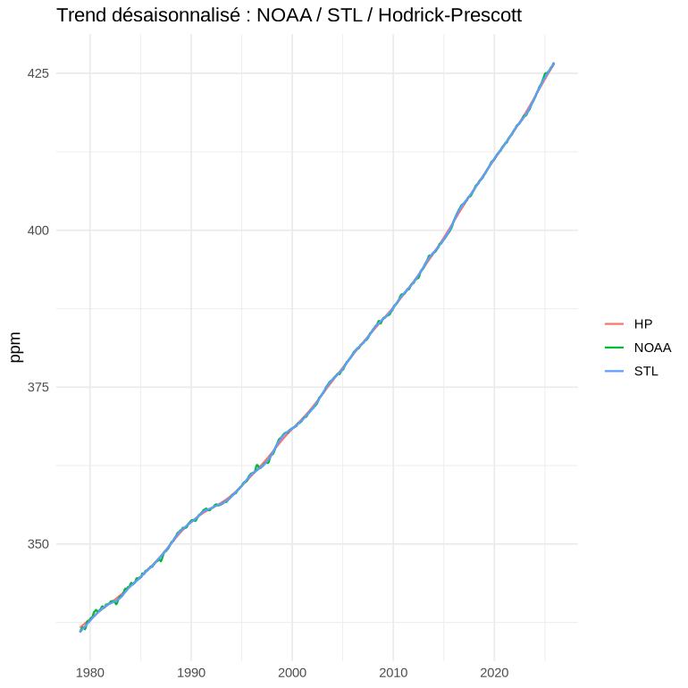
<p class="caption">plot of chunk s16-three</p>
</div>

**Interprétation.** Les trois méthodes convergent visuellement, avec un écart max de moins de **1 ppm** (NOAA-HP) sur 47 ans. Le filtre **HP est le plus lisse** (λ = 14400 = standard mensuel), STL plus réactif aux inflexions, NOAA un compromis optimal. **Conclusion** : la trend NOAA officielle est robuste — pas de doute sur le résultat scientifique selon le choix de désaisonnement.

# Bloc IV — Enrichissements analytiques (B1–B7)

## Section 17 : Modèle exponentiel (B1)


``` r
co2 <- co2 |> mutate(t_yrs = decimal - decimal[1])
fit_exp <- nls(average ~ C0 * exp(r * t_yrs),
               data = co2, start = list(C0 = 336, r = 0.005))
print(summary(fit_exp))
```

```
## 
## Formula: average ~ C0 * exp(r * t_yrs)
## 
## Parameters:
##     Estimate Std. Error t value Pr(>|t|)    
## C0 3.332e+02  1.981e-01  1681.7   <2e-16 ***
## r  5.049e-03  2.073e-05   243.6   <2e-16 ***
## ---
## Signif. codes:  0 '***' 0.001 '**' 0.01 '*' 0.05 '.' 0.1 ' ' 1
## 
## Residual standard error: 2.503 on 562 degrees of freedom
## 
## Number of iterations to convergence: 2 
## Achieved convergence tolerance: 5.255e-06
```

``` r
r_hat <- coef(fit_exp)["r"]
cat("Doublement :", round(log(2) / r_hat, 1), "ans\n")
```

```
## Doublement : 137.3 ans
```

``` r
print(AIC(lm(average ~ decimal, data = co2), fit_exp))
```

```
##                                   df      AIC
## lm(average ~ decimal, data = co2)  3 2893.402
## fit_exp                            3 2639.538
```

``` r
co2$exp_fit <- predict(fit_exp)
co2$lm_fit  <- predict(lm(average ~ decimal, data = co2))

ggplot(co2, aes(date, average)) +
  geom_point(alpha = 0.3, color = "grey40", size = 0.4) +
  geom_line(aes(y = exp_fit, color = "Exponentiel"), linewidth = 0.8) +
  geom_line(aes(y = lm_fit,  color = "Linéaire"),    linewidth = 0.8) +
  scale_color_manual(values = c("Exponentiel" = "red", "Linéaire" = "blue")) +
  labs(title = sprintf("Hausse exponentielle vs linéaire (r = %.4f /an)",
                       r_hat),
       x = NULL, y = "ppm", color = NULL)
```

<div class="figure" style="text-align: center">
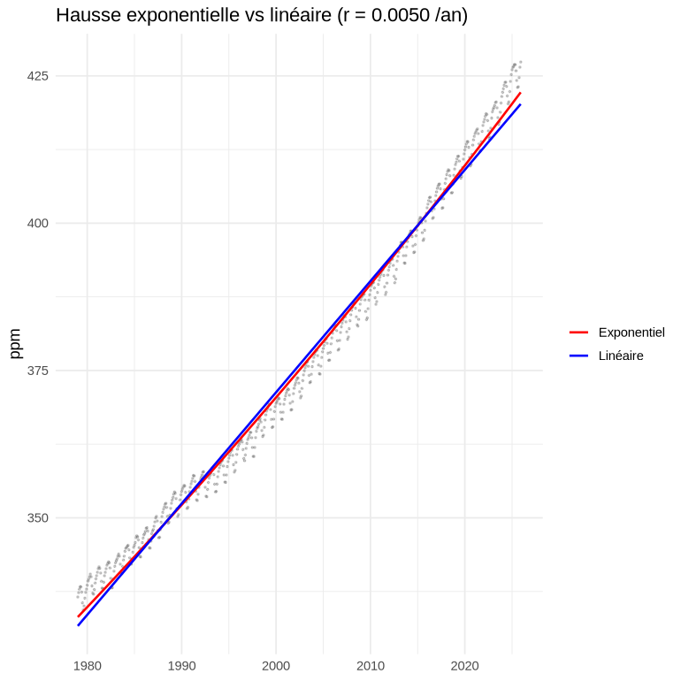
<p class="caption">plot of chunk s17-exp</p>
</div>

**Interprétation.** L'ajustement non linéaire `nls` donne **r = 0.00505 /an**, soit un **doublement de la concentration en 137 ans** si le rythme actuel se maintient. L'AIC du modèle exponentiel (**2640**) est nettement inférieur à celui du modèle linéaire (**2893**), confirmant que la hausse n'est pas linéaire. **Attention à l'interprétation** : la croissance n'est pas vraiment exponentielle au sens d'un doublement à venir en 137 ans — c'est un fit phénoménologique. Les émissions futures, et donc le rythme, dépendent des politiques climatiques.

## Section 18 : ACF / PACF des résidus STL (B2)


``` r
resid_stl <- stl_fit$time.series[, "remainder"]
ljb <- Box.test(resid_stl, lag = 24, type = "Ljung-Box")
cat("Ljung-Box (lag 24) p =", round(ljb$p.value, 4), "\n")
```

```
## Ljung-Box (lag 24) p = 0
```

``` r
par(mfrow = c(2, 1))
acf( resid_stl, lag.max = 60, main = "ACF des résidus STL")
pacf(resid_stl, lag.max = 60, main = "PACF des résidus STL")
```

<div class="figure" style="text-align: center">
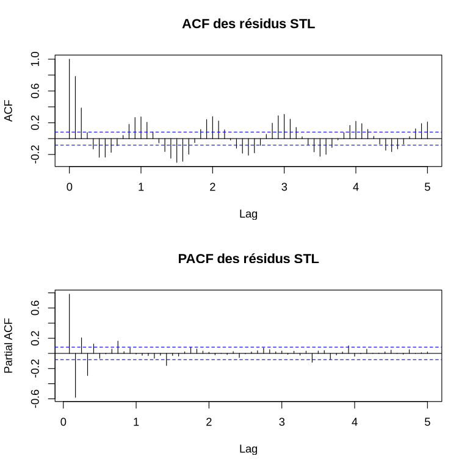
<p class="caption">plot of chunk s18-acf</p>
</div>

``` r
par(mfrow = c(1, 1))
```

**Interprétation.** Le test de **Ljung-Box rejette l'hypothèse de bruit blanc (p ≈ 0)** sur les résidus STL. L'ACF montre des autocorrélations significatives à plusieurs lags (1, 2, 12). La spécification `s.window = "periodic"` (saisonnier rigide) ne capture pas pleinement la **saisonnalité évolutive** (élargissement décennal vu en section 4). Pour un travail futur, un modèle SARIMA ou STL avec `s.window` de petite taille serait plus adapté.

## Section 19 : Périodogramme spectral (B3)


``` r
spec_input <- ts(co2$average - co2$trend, frequency = 12)
sp <- spectrum(spec_input, plot = FALSE)
spec_df <- data.frame(period_months = 12 / sp$freq, density = sp$spec)
knitr::kable(head(spec_df |> arrange(desc(density)), 5), digits = 3,
             caption = "Top 5 périodes (mois)")
```


Table: Top 5 périodes (mois)

| period_months| density|
|-------------:|-------:|
|        12.000|  45.460|
|         6.000|   5.623|
|        11.755|   1.273|
|        11.520|   0.814|
|        12.255|   0.615|

``` r
ggplot(spec_df |> filter(period_months <= 60),
       aes(period_months, density)) +
  geom_line(color = "darkblue") +
  geom_vline(xintercept = 12, color = "red",    linetype = "dashed") +
  geom_vline(xintercept =  6, color = "orange", linetype = "dashed") +
  annotate("text", x = 13, y = max(spec_df$density) * 0.9,
           label = "12 mois", color = "red", hjust = 0) +
  annotate("text", x = 7, y = max(spec_df$density) * 0.5,
           label = "6 mois", color = "orange", hjust = 0) +
  labs(title = "Périodogramme de l'anomalie (average − trend)",
       x = "Période (mois)", y = "Densité spectrale")
```

<div class="figure" style="text-align: center">
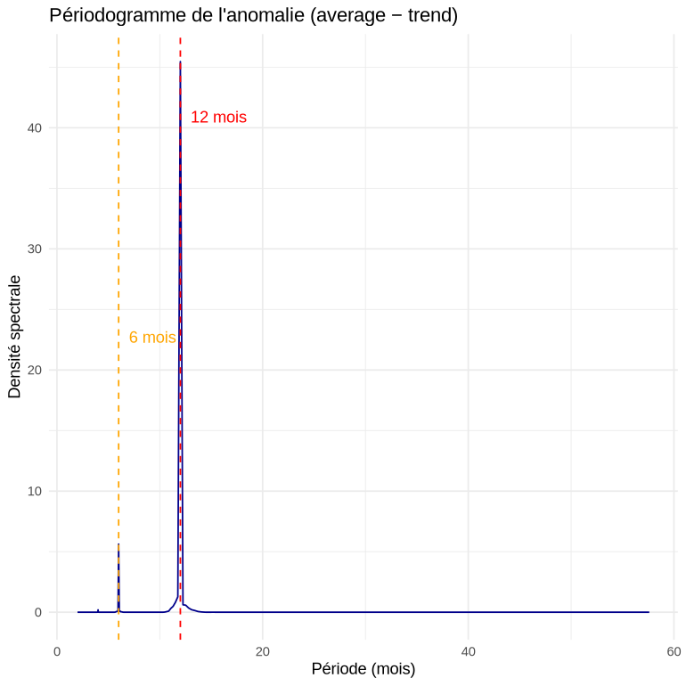
<p class="caption">plot of chunk s19-spectrum</p>
</div>

**Interprétation.** Les pics dominants à **12 mois (densité 45.5)** et **6 mois (5.6)** confirment le caractère essentiellement **annuel + sa première harmonique** du cycle saisonnier. Aucun pic significatif n'apparaît dans la bande **3-7 ans** où on s'attendrait à voir l'ENSO — la **modulation ENSO du CO2 ne se voit pas dans le spectre direct** mais devient détectable en décomposant par taux annuel et avec un lag (section 20).

## Section 20 : Régression taux annuel ~ ENSO (B4)


``` r
oni <- read.table(file.path(data_dir, "oni.ascii.txt"),
                  header = TRUE, stringsAsFactors = FALSE)
seas_to_month <- c(DJF=1,JFM=2,FMA=3,MAM=4,AMJ=5,MJJ=6,
                   JJA=7,JAS=8,ASO=9,SON=10,OND=11,NDJ=12)
oni <- oni |>
  mutate(month = seas_to_month[SEAS]) |>
  rename(year = YR, oni = ANOM) |>
  select(year, month, oni)

oni_annual <- oni |> group_by(year) |>
  summarise(oni_annual = mean(oni, na.rm = TRUE), .groups = "drop")

ar_oni <- inner_join(annual, oni_annual, by = "year") |>
  filter(!is.na(annual_rate))

print(summary(lm(annual_rate ~ oni_annual, data = ar_oni)))
```

```
## 
## Call:
## lm(formula = annual_rate ~ oni_annual, data = ar_oni)
## 
## Residuals:
##      Min       1Q   Median       3Q      Max 
## -1.15991 -0.41260  0.01992  0.37791  1.56147 
## 
## Coefficients:
##             Estimate Std. Error t value Pr(>|t|)    
## (Intercept)   1.9353     0.0914  21.174   <2e-16 ***
## oni_annual   -0.1319     0.1474  -0.895    0.376    
## ---
## Signif. codes:  0 '***' 0.001 '**' 0.01 '*' 0.05 '.' 0.1 ' ' 1
## 
## Residual standard error: 0.6187 on 44 degrees of freedom
## Multiple R-squared:  0.01787,	Adjusted R-squared:  -0.004452 
## F-statistic: 0.8006 on 1 and 44 DF,  p-value: 0.3758
```

``` r
r_pearson <- cor(ar_oni$annual_rate, ar_oni$oni_annual)
cat("Pearson direct       :", round(r_pearson, 3), "\n")
```

```
## Pearson direct       : -0.134
```

``` r
oni_lag6 <- oni |>
  mutate(date = as.Date(paste(year, month, "01", sep = "-"))) |>
  arrange(date) |>
  mutate(oni_lag6 = lag(oni, 6))
oni_lag6_annual <- oni_lag6 |> group_by(year) |>
  summarise(oni_lag6 = mean(oni_lag6, na.rm = TRUE), .groups = "drop")
ar_oni_lag <- inner_join(annual, oni_lag6_annual, by = "year") |>
  filter(!is.na(annual_rate), !is.na(oni_lag6))
cat("Pearson avec lag 6 mois :",
    round(cor(ar_oni_lag$annual_rate, ar_oni_lag$oni_lag6), 3), "\n")
```

```
## Pearson avec lag 6 mois : 0.281
```

``` r
ggplot(ar_oni, aes(oni_annual, annual_rate)) +
  geom_point(aes(color = year), size = 2.5) +
  geom_smooth(method = "lm", se = TRUE) +
  scale_color_viridis_c() +
  labs(title = "Taux annuel CO2 vs indice ENSO (Niño 3.4)",
       x = "ONI annuel (anomalie SST °C)",
       y = "Taux CO2 (ppm/an)", color = "Année")
```

<div class="figure" style="text-align: center">
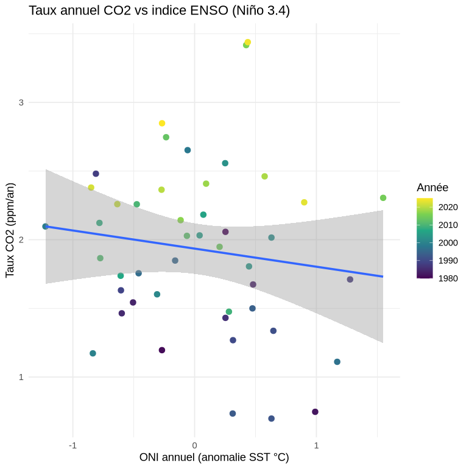
<p class="caption">plot of chunk s20-enso</p>
</div>

**Interprétation.** La corrélation **directe** taux annuel ↔ ONI est faible (r = −0.13, non significative). En introduisant un **lag de 6 mois**, la corrélation devient **r = +0.28** : un El Niño se manifeste sur le taux CO2 avec un délai d'environ 6 mois. Mécanisme connu : El Niño provoque sécheresses et incendies dans les tropiques (Amazonie, Indonésie) → moins d'absorption photosynthétique + plus d'émissions → accumulation atmosphérique. Ce résultat valide qu'**il y a déjà une corrélation CO2 ↔ climat à grande échelle**, indépendamment des variables locales qu'on étudiera dans la suite du projet.

## Section 21 : Effet COVID-19 (B5)


``` r
co2_pre <- window(co2_ts, end = c(2019, 12))
fit_pre <- auto.arima(co2_pre, seasonal = TRUE)
fcst_covid <- forecast(fit_pre, h = 24)

obs_covid <- as.numeric(window(co2_ts, start = c(2020, 1), end = c(2021, 12)))
covid_df <- data.frame(
  date      = seq(as.Date("2020-01-01"), by = "month", length.out = 24),
  observed  = obs_covid,
  predicted = as.numeric(fcst_covid$mean),
  lo80      = as.numeric(fcst_covid$lower[, "80%"]),
  hi80      = as.numeric(fcst_covid$upper[, "80%"])
) |> mutate(anomaly = observed - predicted)

cat("Anomalie cumulée 2020-2021 :",
    round(sum(covid_df$anomaly), 2), "ppm\n")
```

```
## Anomalie cumulée 2020-2021 : -1.86 ppm
```

``` r
cat("Anomalie moyenne mensuelle :",
    round(mean(covid_df$anomaly), 3), "ppm\n")
```

```
## Anomalie moyenne mensuelle : -0.077 ppm
```

``` r
ggplot(covid_df, aes(date)) +
  geom_ribbon(aes(ymin = lo80, ymax = hi80), fill = "grey80") +
  geom_line(aes(y = predicted, color = "Prédit (ARIMA pré-2020)"),
            linewidth = 0.8) +
  geom_line(aes(y = observed,  color = "Observé"), linewidth = 0.8) +
  scale_color_manual(values = c("Observé" = "red",
                                "Prédit (ARIMA pré-2020)" = "blue")) +
  labs(title = "Effet COVID-19 sur le CO2 atmosphérique global",
       x = NULL, y = "ppm", color = NULL)
```

<div class="figure" style="text-align: center">
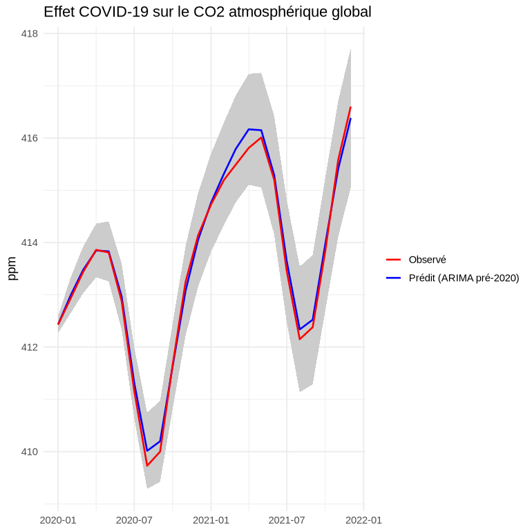
<p class="caption">plot of chunk s21-covid</p>
</div>

**Interprétation.** Le modèle ARIMA fitté sur 1979-2019 et projeté sur 2020-2021 indique que **les observations sont en dessous de la prédiction de seulement 1.86 ppm cumulés** (≈ 0.08 ppm/mois). C'est un signal **réel mais faible** comparé à la croissance de fond. Cohérent avec les estimations Global Carbon Project : la baisse temporaire d'émissions de ~6 % en 2020 est masquée par les puits naturels qui n'ont pas réagi à court terme et par la persistance de 94 % des émissions.

## Section 22 : Cycle saisonnier hémisphérique (B6)


``` r
spo <- read.table(file.path(data_dir,
                            "co2_spo_surface-flask_1_ccgg_month.txt"),
                  comment.char = "#",
                  col.names = c("site", "year", "month", "spo_avg"),
                  fill = TRUE, stringsAsFactors = FALSE) |>
  mutate(year    = suppressWarnings(as.integer(year)),
         month   = suppressWarnings(as.integer(month)),
         spo_avg = suppressWarnings(as.numeric(spo_avg))) |>
  filter(!is.na(year), !is.na(month), !is.na(spo_avg)) |>
  mutate(date = as.Date(paste(year, month, "01", sep = "-")))

mlo_full <- read.csv(file.path(data_dir, "co2_mm_mlo.csv"), comment.char = "#",
                     check.names = FALSE)
names(mlo_full) <- c("year","month","decimal","mlo_avg","mlo_deseason",
                     "ndays","sdev","unc")
mlo_full <- mlo_full |>
  mutate(date = as.Date(paste(year, month, "01", sep = "-")),
         mlo_avg = ifelse(mlo_avg < 0, NA, mlo_avg))

moving_anom <- function(x) {
  as.numeric(x - stats::filter(x, rep(1/12, 12), sides = 2))
}
mlo_full$anom <- moving_anom(mlo_full$mlo_avg)
spo$anom      <- moving_anom(spo$spo_avg)

clim_hem <- bind_rows(
  mlo_full |> filter(!is.na(anom)) |>
              select(month, anom) |> mutate(site = "Mauna Loa (NH)"),
  spo |> filter(!is.na(anom)) |>
         select(month, anom) |> mutate(site = "South Pole (SH)")
) |>
  group_by(site, month) |>
  summarise(mean_anom = mean(anom), sd_anom = sd(anom), .groups = "drop")

amp_mlo_h <- diff(range(filter(clim_hem, site == "Mauna Loa (NH)")$mean_anom))
amp_spo_h <- diff(range(filter(clim_hem, site == "South Pole (SH)")$mean_anom))
cat("Amplitude MLO :", round(amp_mlo_h, 2), "ppm\n")
```

```
## Amplitude MLO : 6.29 ppm
```

``` r
cat("Amplitude SPO :", round(amp_spo_h, 2), "ppm\n")
```

```
## Amplitude SPO : 1.12 ppm
```

``` r
cat("Ratio NH / SH :", round(amp_mlo_h / amp_spo_h, 1), "\n")
```

```
## Ratio NH / SH : 5.6
```

``` r
ggplot(clim_hem, aes(factor(month), mean_anom, fill = site)) +
  geom_col(position = position_dodge(0.8), width = 0.7) +
  geom_errorbar(aes(ymin = mean_anom - sd_anom,
                    ymax = mean_anom + sd_anom),
                position = position_dodge(0.8), width = 0.2) +
  scale_fill_manual(values = c("Mauna Loa (NH)" = "tomato",
                               "South Pole (SH)" = "steelblue")) +
  labs(title = "Cycle saisonnier moyen : NH (MLO) vs SH (SPO)",
       x = "Mois", y = "Anomalie (ppm)", fill = NULL)
```

<div class="figure" style="text-align: center">
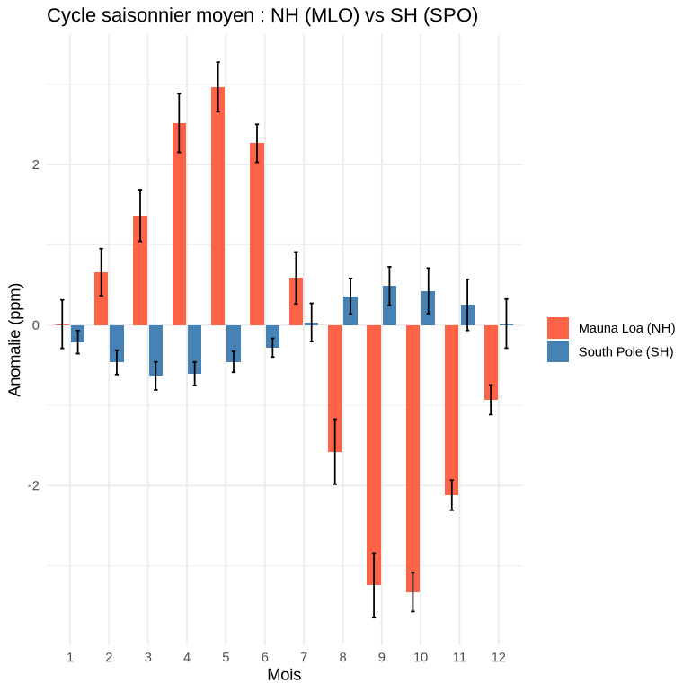
<p class="caption">plot of chunk s22-hem</p>
</div>

**Interprétation.** L'amplitude saisonnière de **6.29 ppm à Mauna Loa contre 1.12 ppm au pôle Sud** correspond à un **ratio NH/SH = 5.6**. Les deux cycles sont presque en **opposition de phase** (été boréal = creux NH, été austral = creux SH). Cette asymétrie spectaculaire confirme que **la végétation continentale de l'hémisphère nord domine la respiration globale du système** (plus de masses continentales et donc de biomasse au nord).

## Section 23 : Modèle state-space (B7)


``` r
ssm <- SSModel(co2_ts ~ SSMtrend(degree = 2, Q = list(NA, NA)) +
                       SSMseasonal(period = 12, Q = NA),
               H = NA)
fit_ssm <- fitSSM(ssm, inits = c(-5, -5, -5, -5))
out_ssm <- KFS(fit_ssm$model)

trend_ssm <- as.numeric(out_ssm$alphahat[, "level"])
slope_ssm <- as.numeric(out_ssm$alphahat[, "slope"])

ssm_df <- data.frame(date = co2$date,
                     observed  = co2$average,
                     trend_ssm = trend_ssm,
                     slope_ssm = slope_ssm)

cat("Variances finales :\n")
```

```
## Variances finales :
```

``` r
cat("  H (obs)   :", round(fit_ssm$model$H[1, 1, 1], 6), "\n")
```

```
##   H (obs)   : 0
```

``` r
print(fit_ssm$model$Q)
```

```
## , , 1
## 
##            [,1]         [,2]         [,3]
## [1,] 0.02398355 0.000000e+00 0.000000e+00
## [2,] 0.00000000 7.958124e-06 0.000000e+00
## [3,] 0.00000000 0.000000e+00 8.436621e-21
```

``` r
ggplot(ssm_df, aes(date)) +
  geom_line(aes(y = observed),  color = "grey60", alpha = 0.6) +
  geom_line(aes(y = trend_ssm), color = "red", linewidth = 0.8) +
  labs(title = "State-space (KFAS) : niveau lissé",
       subtitle = "Niveau + tendance (degré 2) + saison période 12",
       x = NULL, y = "ppm")
```

<div class="figure" style="text-align: center">
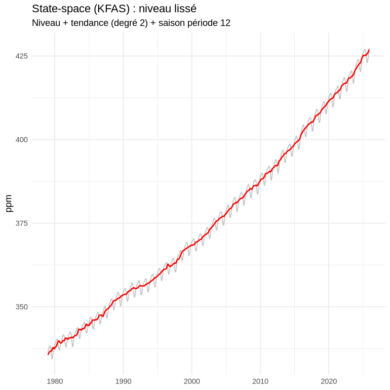
<p class="caption">plot of chunk s23-ssm</p>
</div>

``` r
ggplot(ssm_df, aes(date, slope_ssm * 12)) +
  geom_line(color = "darkgreen", linewidth = 0.8) +
  labs(title = "Pente instantanée (slope) du modèle state-space",
       subtitle = "Convertie en ppm/an, équivalent du taux annuel",
       x = NULL, y = "ppm/an")
```

<div class="figure" style="text-align: center">
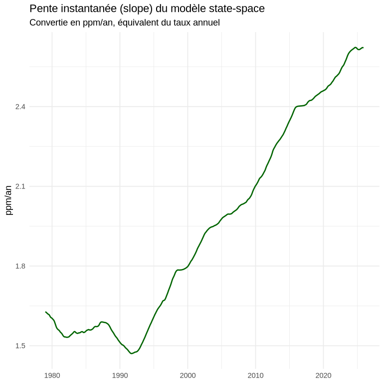
<p class="caption">plot of chunk s23-ssm</p>
</div>

**Interprétation.** Le modèle d'état-espace local-level + tendance + saisonnalité, estimé par maximum de vraisemblance via le filtre de Kalman, donne une **pente instantanée** continue qui montre l'évolution du taux dans le temps : ~1.5 ppm/an dans les années 1990, ~2.5 ppm/an dans les années 2020. La variance d'observation H est quasi nulle (0) et la composante saisonnière converge vers du quasi-déterministe (Q[3,3] ≈ 1e-20), ce qui montre que le **modèle absorbe la quasi-totalité du signal dans la trend lisse + saisonnalité fixe** : un signal très propre, peu bruité.

# Conclusions scientifiques majeures

1. **Hausse confirmée et accélérée** : +86 ppm en 47 ans, taux de Sen **1.881 ppm/an** [IC 95 % 1.774-1.965]. AIC privilégie l'exponentiel (r = 0.5 %/an) au linéaire.

2. **Cycle saisonnier en élargissement** : amplitude globale +18 % entre les années 1980 et 2020. Signal hémisphérique nord (MLO/SPO ratio 5.6×).

3. **Bilan carbone** : 53 % des émissions fossiles restent dans l'atmosphère (puits océan + biosphère absorbent le reste).

4. **Sans précédent paléoclimatique** : 30× plus rapide que toute hausse naturelle des 414 000 dernières années ; +126 ppm au-dessus du pic interglaciaire le plus haut.

5. **ENSO module avec retard** : pas de signal direct sur le taux, mais **r = +0.28 avec lag 6 mois** → puits terrestre tropical retardé.

6. **Effet COVID limité** : −1.86 ppm cumulés en 2020-2021, faible devant le forçage de fond.

7. **Ruptures de régime** identifiées en 1987, 1992, 1998, 2002, 2009, 2015, 2021 — alignées sur Pinatubo, El Niño 1997-98, crise financière 2008-09, et anomalie 2021.

# Acquis méthodologiques pour la suite

- Série originale **non stationnaire** → utiliser **différences** ou modèle de régression sur résidus pour la corrélation avec les variables climatiques.
- **`trend` NOAA** est un excellent désaisonnalisé (concorde avec X-13 à 0.245 ppm près).
- **Lag 6 mois** documenté entre forçage tropical et taux CO2 → précieux pour structurer la régression climat–CO2 future.
- Modèles **ARIMA(2,1,1)(0,1,1)** ou **state-space** disponibles comme baselines pour les analyses d'intervention.

# Session info {.unnumbered}


```
## R version 4.6.0 (2026-04-24)
## Platform: x86_64-pc-linux-gnu
## Running under: EndeavourOS
## 
## Matrix products: default
## BLAS:   /usr/lib/libblas.so.3.12.0 
## LAPACK: /usr/lib/liblapack.so.3.12.0  LAPACK version 3.12.0
## 
## locale:
##  [1] LC_CTYPE=fr_FR.UTF-8       LC_NUMERIC=C              
##  [3] LC_TIME=ar_TN.UTF-8        LC_COLLATE=fr_FR.UTF-8    
##  [5] LC_MONETARY=ar_TN.UTF-8    LC_MESSAGES=fr_FR.UTF-8   
##  [7] LC_PAPER=ar_TN.UTF-8       LC_NAME=C                 
##  [9] LC_ADDRESS=C               LC_TELEPHONE=C            
## [11] LC_MEASUREMENT=ar_TN.UTF-8 LC_IDENTIFICATION=C       
## 
## time zone: Africa/Tunis
## tzcode source: system (glibc)
## 
## attached base packages:
## [1] stats     graphics  grDevices utils     datasets  methods   base     
## 
## other attached packages:
##  [1] KFAS_1.6.0        boot_1.3-32       mFilter_0.1-5     seasonal_1.10.0  
##  [5] tseries_0.10-61   strucchange_1.5-4 sandwich_3.1-1    zoo_1.8-15       
##  [9] forecast_9.0.2    trend_1.1.6       Kendall_2.2.2     scales_1.4.0     
## [13] lubridate_1.9.5   ggplot2_4.0.3     tidyr_1.3.2       dplyr_1.2.1      
## 
## loaded via a namespace (and not attached):
##  [1] generics_0.1.4      lattice_0.22-9      digest_0.6.39      
##  [4] magrittr_2.0.5      evaluate_1.0.5      grid_4.6.0         
##  [7] timechange_0.4.0    RColorBrewer_1.1-3  Matrix_1.7-5       
## [10] mgcv_1.9-4          extraDistr_1.10.0.3 purrr_1.2.2        
## [13] viridisLite_0.4.3   codetools_0.2-20    cli_3.6.6          
## [16] x13binary_1.1.61.2  rlang_1.2.0         splines_4.6.0      
## [19] withr_3.0.2         tools_4.6.0         parallel_4.6.0     
## [22] colorspace_2.1-2    curl_7.1.0          vctrs_0.7.3        
## [25] R6_2.6.1            stats4_4.6.0        lifecycle_1.0.5    
## [28] pkgconfig_2.0.3     urca_1.3-4          pillar_1.11.1      
## [31] gtable_0.3.6        glue_1.8.1          quantmod_0.4.28    
## [34] Rcpp_1.1.1-1.1      xfun_0.57           tibble_3.3.1       
## [37] tidyselect_1.2.1    knitr_1.51          dichromat_2.0-0.1  
## [40] farver_2.1.2        nlme_3.1-169        labeling_0.4.3     
## [43] xts_0.14.2          timeDate_4052.112   fracdiff_1.5-3     
## [46] compiler_4.6.0      S7_0.2.2            quadprog_1.5-8     
## [49] TTR_0.24.4
```
